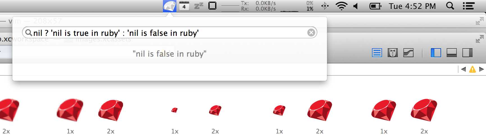

# Ruber

Ruby REPL in your Menubar. You know this was gonna happen.


## Why

To learn ruby the easy way. Oh yeah there is also a keyboard shortcut: ```<Option>+<Shift>+R```



# License

Ruber is licensed under the BSD license.
