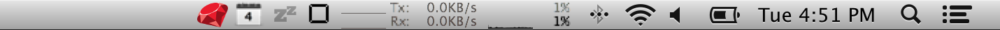

# Ruber

Ruby REPL in your Menubar. You know this was gonna happen.



## Why

To learn ruby the easy way. Oh yeah there is also a keyboard shortcut: ```<Option>+<Shift>+R```

## Ready to eat version

You can just [download it here](https://github.com/soheil/Ruber/raw/master/Ruber.app) if you don't wanna mess with the code.


# License

Ruber is licensed under the BSD license.
